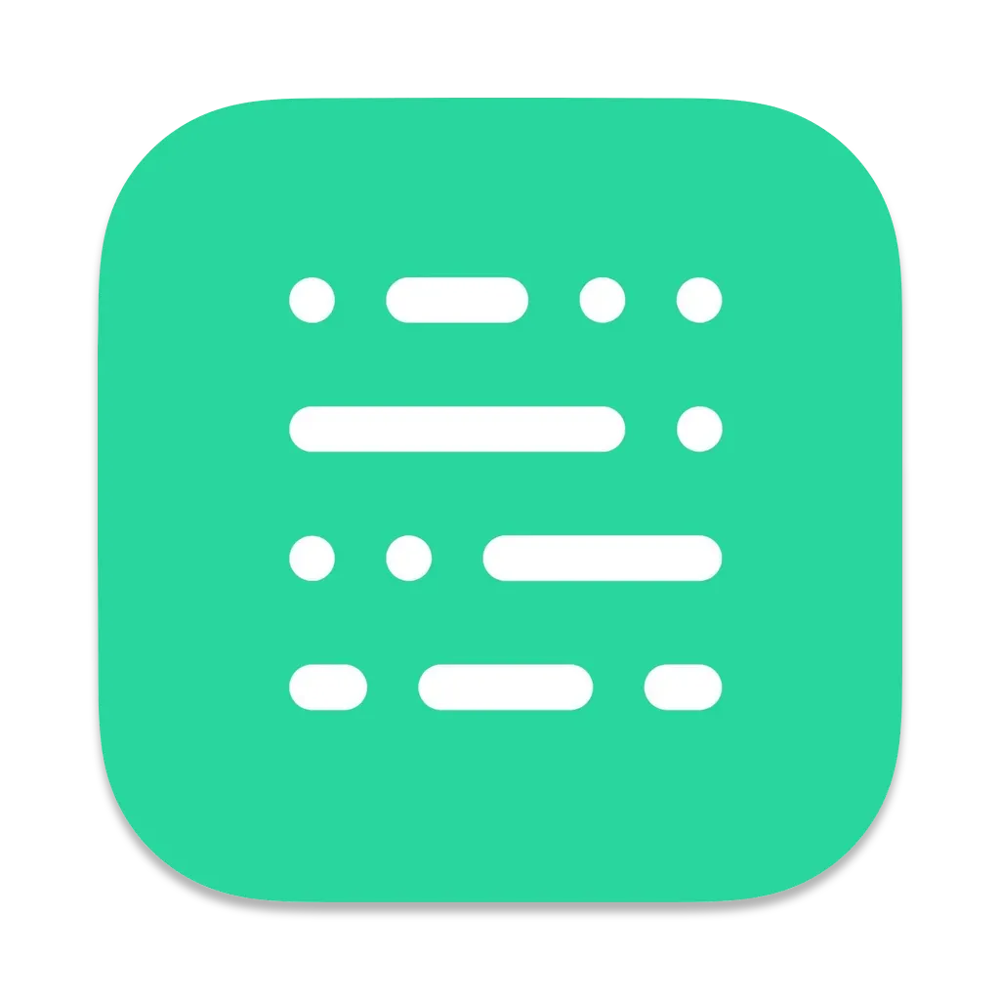
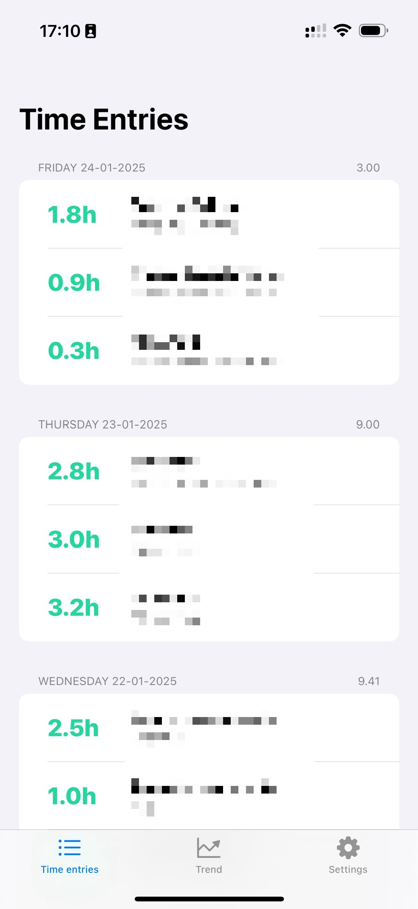
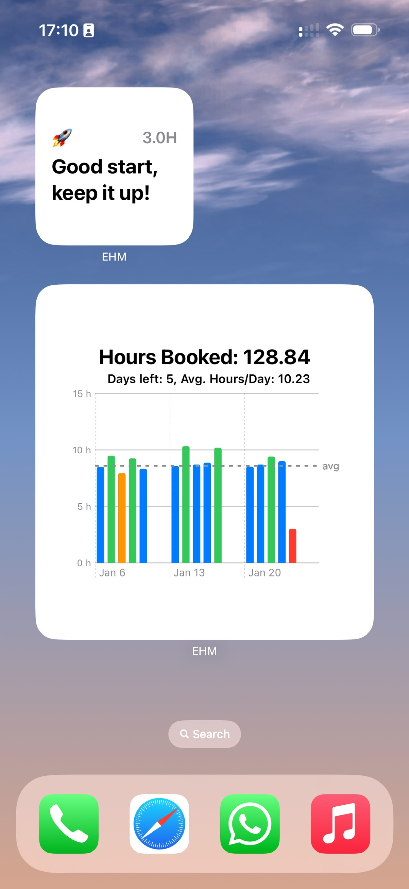
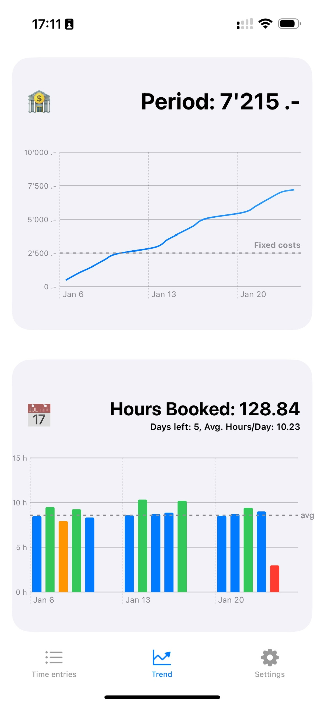
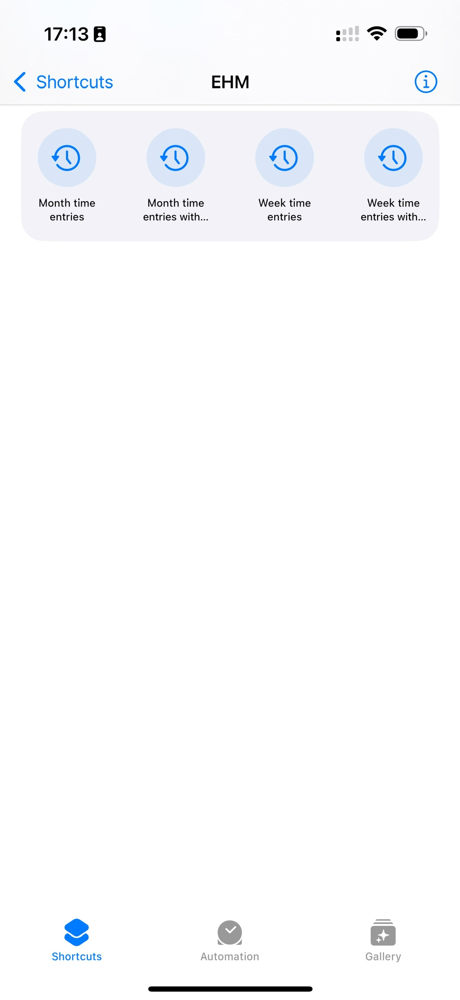

    

<h1 align="center">
   EHM -  Earnings and <s>Hobbies</s> Management
</h1>
EHM is an iOS application designed to help you manage your earnings efficiently. Initially intended to manage both earnings and hobbies expenses, the app now focuses solely on earnings while retaining its original name due to its appeal.

## Features

- **Sync Data from Redmine**: Seamlessly integrate and sync your data from Redmine.
- **Set Hourly Rate**: Define your hourly income rate for accurate earnings tracking.
- **Track Monthly Earnings and Fixed Costs**: Monitor your monthly earnings and manage fixed costs effectively.
- **Track Monthly Hours Goal**: Set and track your monthly hours goal to ensure you meet your targets.

## Screenshots

- **Time Entries**
  

      
  

- **Widgets**
  

      
  

- **Charts**
  

      
  

- **App Intents with Shortcuts**
  

      
  

- **Integration with Apple Intelligence**
  

      
  

## Setup Instructions

1. **Update the App Identifier**
   - Replace `com.occhipinti.ehm` with a suitable bundle identifier specific to your team or app.
   - In Xcode, navigate to **Project Navigator > Your Project > Targets > General > Identity**.
   - Update the **Bundle Identifier** field with your new identifier (e.g., `com.yourname.ehm`).

2. **Update Container Groups**
   - Ensure all occurrences of `com.occhipinti.ehm` in the container groups are updated.
   - Search for `com.occhipinti.ehm` in the project files (press `Cmd + Shift + F`).
   - Replace all instances with the new identifier (e.g., `com.yourname.ehm`).

3. **Check Capabilities**
   - Go to **Signing & Capabilities** in Xcode.
   - Ensure iCloud is enabled and linked to your updated container.

# Author 🧑‍💻

    
     
    <a href="https://occhipinti.dev">
        Gianlorenzo Occhipinti
    </a>

# License 📝

This project is open-sourced under the MIT License - see the [LICENSE](LICENSE) file for details.
